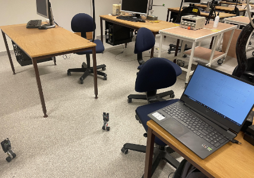
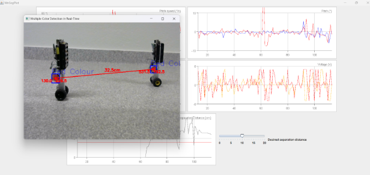

# Collaborative Control between Two Balancing Robots using Camera Feedback 

This project was developed as part of a robotics and control systems course at LTH – Lund University during the 2023-1 semester. It features a custom Graphical User Interface (GUI) to integrate and control two robotic systems with a variable distance separation. The system supports real-time data visualization through wireless communication, enabling intuitive monitoring and interaction.

Additionally, the system includes a camera-based feedback module written in Python using OpenCV, which estimates the distance between the two robots in real time. This allows adaptive control and coordination based on live spatial measurements.

*Experimental setup with both robots, camera, and wireless modules*

*Graphical User Interface for control and data visualization*
